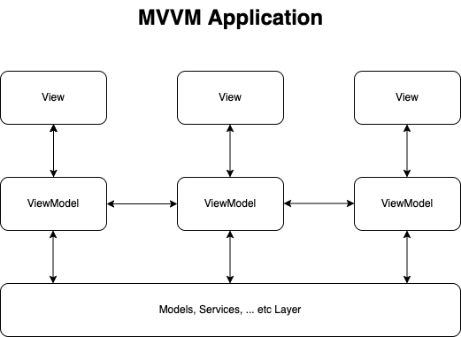

---
foam_template:
  name: Blog Docusaurus Template
  description: Creates Docusaurus blog/slip
  filepath: blog/wiki-wpf.mdx # See using [Variable transforms](https://code.visualstudio.com/docs/editor/userdefinedsnippets#_variable-transforms )
authors:
  - frank
tags:
  - wiki
  - wpf
description: Wiki WPF
keywords:
  - Wiki WPF
image: https://i.imgur.com/mErPwqL.png
date: 2023-09-15
draft: false
enableComments: true # for Gisqus
---

# WPF

[GitHub - SingletonSean/wpf-tutorials: Tutorial source code for WPF concepts.](https://github.com/SingletonSean/wpf-tutorials)

[GitHub - liviaerxin/WPF-MVVM-EFC-Example: 📲 MVVM (WPF) application built with EFCore, Abstract Factory pattern and dependency injection (Microsoft Unity)](https://github.com/liviaerxin/WPF-MVVM-EFC-Example)

## MVVM

[MVVM Pattern Made Simple - CodeProject](https://www.codeproject.com/Articles/278901/MVVM-Pattern-Made-Simple)

[MVVM in Depth - CodeProject](https://www.codeproject.com/Articles/659614/MVVM-in-Depth)

[My attempt to understand MVVM pattern and questions raised during it : csharp](https://www.reddit.com/r/csharp/comments/i3pbmt/my_attempt_to_understand_mvvm_pattern_and/)

[Patterns - WPF Apps With The Model-View-ViewModel Design Pattern | Microsoft Docs](https://docs.microsoft.com/en-us/archive/msdn-magazine/2009/february/patterns-wpf-apps-with-the-model-view-viewmodel-design-pattern)

[Introduction to the MVVM Toolkit - Windows Community Toolkit | Microsoft Docs](https://docs.microsoft.com/en-us/windows/communitytoolkit/mvvm/introduction)

## Features

- IoC, Inversion of Control
- DI, Dependency Injection
- Navigation
- ViewModel-to-ViewModel Communication
  - [MVVM Light Messenger](https://dotnetpattern.com/mvvm-light-messenger/)
  - [Event Aggregator | Prism](https://prismlibrary.com/docs/event-aggregator.html)
  - [ReactiveUI - Message Bus](https://www.reactiveui.net/docs/handbook/message-bus/)
- Observable Object in ViewModel
  - Wrapping a non-observable model

    ```C#
    // https://docs.microsoft.com/en-us/windows/communitytoolkit/mvvm/observableobject#wrapping-a-non-observable-model
    public class ObservableUser : ObservableObject
    {
        private readonly User user;mvvm-application.png

        public ObservableUser(User user) => this.user = user;

        public string Name
        {
            get => user.Name;
            set => SetProperty(user.Name, value, user, (u, n) => u.Name = n);
        }
    }
    ```

## Principles



- View-to-ViewModel one-to-one/many-to-one mapping
- ViewModel-to-ViewModel communication
- ViewModel-to-Model one-to-one/one-to-many binding

## Access Database

DAO or Repository

Entity
DB Context

## ReactiveUI

[To property - pasoft-share/ReactiveUI](https://pasoft-sharereactiveui.readthedocs.io/en/stable/basics/to-property/)

One of the core features of ReactiveUI is to be able to convert properties to Observables, via WhenAny , and to convert Observables into Properties, via a method called ToProperty . These properties are called Output Properties in ReactiveUI, and they are a huge part of using the framework effectively.
